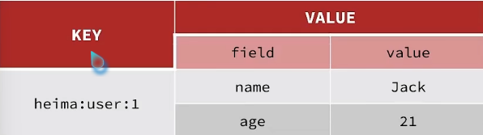

session共享

对于tomcat集群情况下,session无法共享(保存在服务器的)，第一台服务器登录，第二次请求访问第二台服务器了，会导致整个登录拦截功能失效

对于这种简单用户数据的存储，我们可以考虑使用String或者hash 2种类型

String 用json字符串存储，比较直观，hash可以将对象中每个字段独立存储，可以单个字段crud，并且内存占用更少。

使用redis存储验证码功能

拦截器业务逻辑实现，2个拦截器实现刷新有效期与用户信息保存