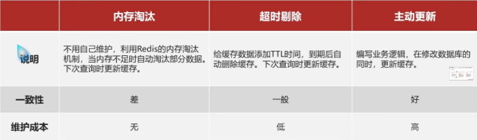

店铺信息查询数据库太慢，使用redis作为中间缓存
先查redis然后看是否存在存在返回，不存在查数据库，查到数据库后存入redis，数据库查不到报错
这里有个问题，就是数据库与redis不一致的问题，解决方案如下，代码下次提交

缓存更新策略，建议主动更新数据库数据的时候把redis缓存删除

缓存不一致解决方案
人工编码方式：更新完数据库后再去更新缓存，称为双写方案

如何保证同时成功或者失败
单体系统放在一个事务里面
分布式系统TCC分布式事务方案

选删除缓存比较好，这时先删缓存再处理数据库，还是先处理数据库再删除缓存？
第一种第一个线程先删除缓存a=1，然后更新数据库a=1，这个时间中间，线程2查询缓存没命中，然后写入缓存a=2再更新数据库a=2，
线程1没有及时更新数据库导致把最新的数据库数据覆盖出现问题数据库数据不是最新，但几率较低
第二种第一个线程先查缓存没命中线程1更新数据库a=1,然后写入缓存a=1，这个时间中间线程2更新数据库a=2 然后删除缓存a=2，
线程1没有及时更新缓存导致缓存不是最新的数据库的数据，出现问题，但总的来说这种几率更低，再加个超时时间兜底

