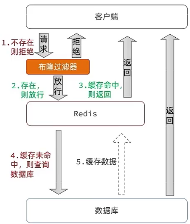

如上节所说，查询数据库写入缓存的时候我们增加过期时间兜底
更新数据库我们删除策略先更新数据库再删除缓存，同时加上事务注解，这样出现不一致的概率最低

缓存穿透，随机id恶意请求，这个时候redis肯定没有，数据库也没有，会导致数据库被打宕机，
解决方案1 数据库没有，缓存null到redis顶住压力，缺点是额外的内存消耗，但我们并设置TTL时间10分钟也可以解决
        还有就是数据不一致，有个真的信息更新到数据库，刷到redis，此时另一个线程已经查询了是不存在，把null放进了redis替换了真的数据
解决方案2 布隆过滤器，先走过滤器，过滤器不存在就一定不存在，过滤器存在但不一定，这是因为使用哈希函数处理就一定存在冲突，这个后续再讲

其他应该做好的基础设施
增强id的复杂度，避免被猜测id规律 id先做好处理，然后做好格式校验，非系统id就pass，就可以防止恶意攻击了
加强用户权限校验
做好热点参数的限流

代码种使用缓存空值处理下缓存穿透

