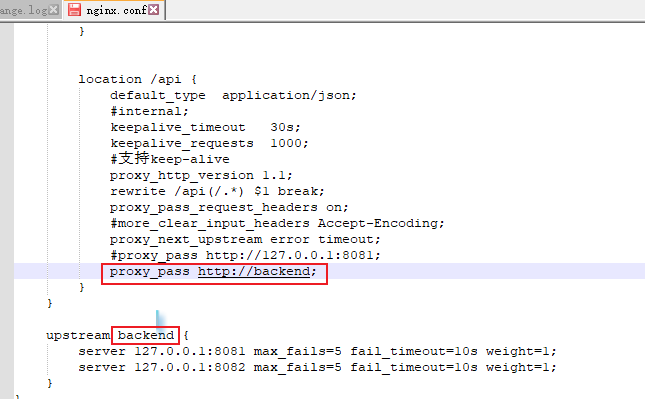

优惠券秒杀
乐观锁与悲观锁
悲观锁使用syn或者lock保证串行执行代码，但是高并发效果太差
乐观锁使用版本号对比更新前的版本与更新后一直才算成功，实验结果大部分更新失败，因为高并发下大部分数据一开始获取的版本号都一样，但实际上
对比的时候，版本号已被某个线程修改，导致版本号都不一样，导致大部分都失败
建议使用数据库行锁，where stock-1 > 0 防止数据超卖

tips：
Java8 提供的一个对AtomicLong改进后的一个类，LongAdder是针对乐观锁的优化处理，大量线程并发更新一个原子性的时候，
天然的问题就是自旋，会导致并发性问题，当然这也比我们直接使用syn来的好 所以利用这么一个类，LongAdder来进行优化
如果获取某个值，则会对cell和base的值进行递增，最后返回一个完整的值

java8提供的LocalDateTime类型为java8优化时间使用推出的时间类型，分时区，国际时区是UTC
共有LocalDate（2021-9-1），LocalTime（08：07），LocalDateTime（2021-09-01 11：07）三种，
分别对应数据库date，time，dateTime三种，使用起来很方便

一人一单问题，保证同一张优惠券一个人只能获取一张。
那我们就必须要加锁保证代码的统一时间同一个用户id只能进到这段代码一次，我们可以考虑用用户id加锁保证锁的粒度够细，
用户id的toString().intern()保证了字符串是在常量池中拿的，保证了锁的唯一性
还有就是为了保证事务完整提交和锁的释放是同步的，我们应该先枪锁后，开始事务的处理，最后事务提交后释放锁。这里的代码逻辑需要注意

使用intern只能保证单体环境下的一人一单，如果又多台机器，多个jvm多个常量池就锁不住了，所以考虑使用分布式锁
这里先搭建环境，nginx使用反向代理一下，idea可以使用vm options 中填写指令-Dserver.port = 8082再启动一个服务
